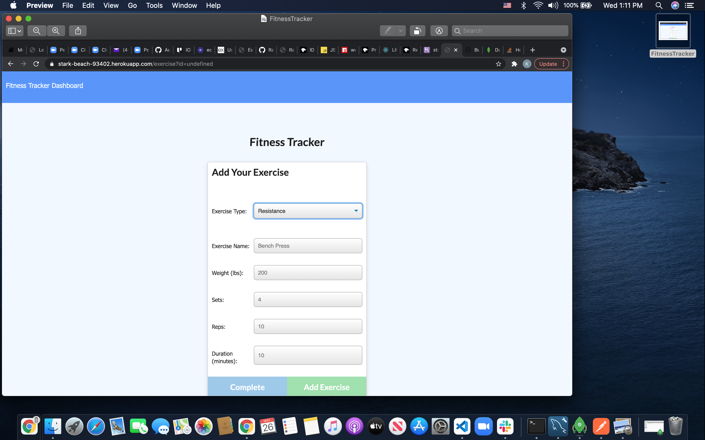

# WorkoutTracker

  ## Description 
  
  * What's the Objective:* 
  
  This app will help a user keep track of their workout routines, in order to complete
  
  ## Table of Contents
  * [Installation](#installation)
  * [Usage](#usage)
  * [Contributing](#contributing)
  * [License](#license)
  
  ## Installation
  
  * Here's how to install it:*
  
  install node and inquirer read docs if necessary
  
  ## Usage 
  
  * Instructions and demo:

   
   
   
   
   

   vid or pic here
  
  ## Tests
  
  * Here's how to test the app:*
  
   Run it and use the terminal's console to check for errors.
  
  ## License
  
  MIT License
  
    
    * email
    
     undefined
  ---
  
  ## Questions?
  
  
  For any questions, please contact me with the information below:
 
  GitHub: [@Rasbakimo](undefined)